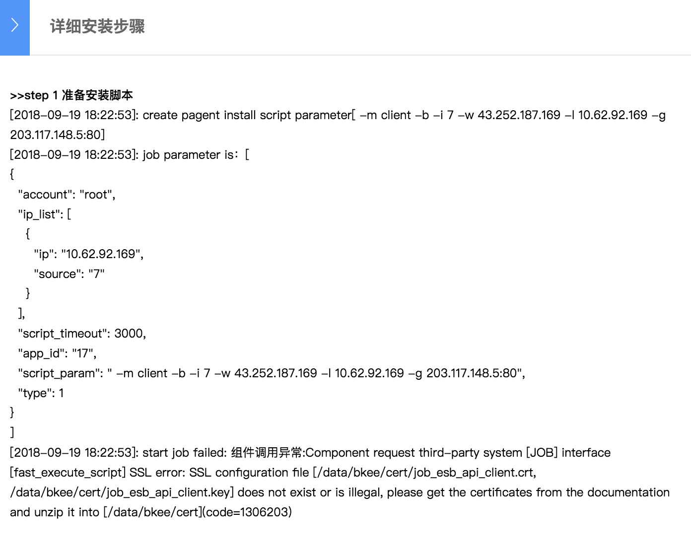

# "SSL error




Issue "SSL error: SSL configuration file \[/data/bkee/cert/job\_esb\_api\_client.crt, /data/bkee/cert/job\_esb\_api\_client.key\] does not exist or is illegal": 

is caused by certs on esb servers is not updated to newest one. We synchronized "gse\_job\_api\_client.truststore", "job\_server.keystore","job\_server.truststore" on job servers and open\_paas servers. And need restart service after update certs. Path for cert files: /data/bkee/cert.

```text
#on central controller machine
scp shilei@192.168.1.5:/data/bkee/cert/gse_job_api_client.truststore .
scp shilei@192.168.1.5:/data/bkee/cert/job_server.keystore .
scp shilei@192.168.1.5:/data/bkee/cert/job_server.truststore .

scp ./gse_job_api_client.truststore shilei@192.168.1.7:/home/shilei
scp ./job_server.keystore shilei@192.168.1.7:/home/shilei
scp ./job_server.truststore shilei@192.168.1.7:/home/shilei

scp ./gse_job_api_client.truststore shilei@192.168.1.4:/home/shilei
scp ./job_server.keystore shilei@192.168.1.4:/home/shilei
scp ./job_server.truststore shilei@192.168.1.4:/home/shilei

#on 192.168.1.7 &192.168.1.4  /home/shilei
mv ./gse_job_api_client.truststore /data/bkee/cert/
mv ./job_server.keystore /data/bkee/cert 
mv ./job_server.truststore /data/bkee/cert
```


```text
#on central controller machine
/data/install/bkeec stop job
/data/install/bkeec start job
```


