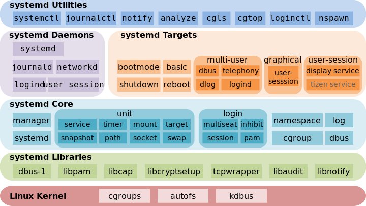

# Systemd

## 1.init 

```text
sudo /etc/init.d/apache2 start
#or
service apache2 start
```

This approach has two drawbacks.

* First, the startup time is long. The init process is a serial start, and the next process will be started only after the previous process is started.
* The second is the startup script is complicated. The init process just executes the startup script, no matter what else. Scripts need to handle various situations themselves, which often makes the scripts very long.

## 2.systemd

Systemd was born to solve these problems. It is designed to provide a complete solution for system startup and management.

With Systemd, you don't need to use init again. Systemd replaces initd and becomes the first process of the system \(PID equals 1\), and other processes are its child processes.

The advantages of Systemd are that they are powerful and easy to use. The disadvantage is that the system is huge and complex. In fact, there are still many people who oppose Systemd, on the grounds that it is too complex and strongly coupled with the rest of the operating system, violating the "keep simple, keep stupid" Unix philosophy.



## System management

Systemd is not a command, but a set of commands that cover all aspects of system management.

### 3.1 systemctl

Systemctl is the main command of Systemd for managing systems


```text
# reboot
$ sudo systemctl reboot

# poweroff
$ sudo systemctl poweroff

# CPU stops working
$ sudo systemctl halt

# pause
$ sudo systemctl suspend

# Let the system go into hibernation
$ sudo systemctl hibernate

# Put the system into interactive sleep
$ sudo systemctl hybrid-sleep

# Start to enter rescue state (single user state)
$ sudo systemctl rescue
```

### 3.2 systemd-analyze 

The systemd-analyze command is used to view the startup time.

```text
# View startup time
$ systemd-analyze

# View the start time of each service
$ systemd-analyze blame

# Show waterfall-like startup process flow
$ systemd-analyze critical-chain

# Display the startup flow of the specified service
$ systemd-analyze critical-chain atd.service
```

### 3.3 hostnamectl 

The hostnamectl command is used to view information about the current host.

```text
#Display information about the current host
$ hostnamectl
#Set the host name.
$ sudo hostnamectl set-hostname rhel7 
```

### 3.4 localectl 

The localectl command is used to view localization settings.

```text
#View localization settings
$ localectl
#Set localization parameters.
$ sudo localectl set-locale LANG=en_GB.utf8 
$ sudo localectl set-keymap en_GB
```

### 3.5 timedatectl

```text
# View current time zone settings
$ timedatectl

# Show all available time zones
$ timedatectl list-timezones

# Set the current time zone
$ sudo timedatectl set-timezone America/New_York
$ sudo timedatectl set-time YYYY-MM-DD
$ sudo timedatectl set-time HH:MM:SS
```

### 3.6 loginctl

```text
# List current session
$ loginctl list-sessions

# List the currently logged in user
$ loginctl list-users

# List information showing the specified user
$ loginctl show-user ruanyf
```

## 4. Unit

### 4.1 Meaning

Systemd can manage all system resources. Different resources are collectively referred to as Units.

Units are divided into 12 types.

* Service unit：系统服务
* Target unit：多个 Unit 构成的一个组
* Device Unit：硬件设备
* Mount Unit：文件系统的挂载点
* Automount Unit：自动挂载点
* Path Unit：文件或路径
* Scope Unit：不是由 Systemd 启动的外部进程
* Slice Unit：进程组
* Snapshot Unit：Systemd 快照，可以切回某个快照
* Socket Unit：进程间通信的 socket
* Swap Unit：swap 文件
* Timer Unit：定时器

The systemctl list-units command can view all Units of the current system.

```text
# List the running Unit
$ systemctl list-units

# List all Units, including no configuration files found or failed to start
$ systemctl list-units --all

# List all units that are not running
$ systemctl list-units --all --state=inactive

# List all units that failed to load
$ systemctl list-units --failed

# List all running units of type service
$ systemctl list-units --type=service
```

### 4.2 Status of Unit

```text
# Display system status
$ systemctl status

# Display the status of a single unit
$ sysystemctl status bluetooth.service

# Display the status of a unit on the remote host
$ systemctl -H root@rhel7.example.com status httpd.service
```

In addition to the status command, systemctl also provides a simple method for three query states, mainly for use in the internal judgment statements of the script.

```text
# Show if a Unit is running
$ systemctl is-active application.service

# Display whether a Unit is in a startup failure state
$ systemctl is-failed application.service

# Display whether a Unit service has established a startup link
$ systemctl is-enabled application.service
```

### 4.3 Unit Management

```text
#Start a service now
$ sudo systemctl start apache.service

# Stop a service immediately
$ sudo systemctl stop apache.service

# Restart a service
$ sudo systemctl restart apache.service

# Kill all child processes of a service
$ sudo systemctl kill apache.service

# Reload a service's configuration file
$ sudo systemctl reload apache.service

# overload all modified configuration files
$ sudo systemctl daemon-reload

# Display all the underlying parameters of a Unit
$ systemctl show httpd.service

# Display the value of the specified attribute of a Unit
$ systemctl show -p CPUShares httpd.service

# Set the specified attribute of a Unit
$ sudo systemctl set-property httpd.service CPUShares=500
```

### 4.4 Dependencies

There is a dependency between Units: A depends on B, which means that Systemd will start B when it starts A.

The systemctl list-dependencies command lists all the dependencies of a Unit.

```text
$ systemctl list-dependencies nginx.service
```

Among the output of the above command, some dependencies are of the Target type \(see below\), and the default is not expanded. If you want to expand Target, you need to use the --all parameter.

```text
$ systemctl list-dependencies --all nginx.service
```

## 5. Unit's configuration file

5.1 Overview

Each Unit has a configuration file that tells Systemd how to start the Unit.

By default, Systemd reads the configuration file from the directory /etc/systemd/system/. However, most of the files stored inside are symbolic links, pointing to the directory /usr/lib/systemd/system/, where the real configuration files are stored.

The systemctl enable command is used to establish a symbolic link relationship between the two directories above.

```text
$ sudo systemctl enable clamd@scan.service
# equals to
$ sudo ln -s '/usr/lib/systemd/system/clamd@scan.service' '/etc/systemd/system/multi-user.target.wants/clamd@scan.service'
```

If the boot file is set to boot, the systemctl enable command is equivalent to activating the boot.  
Correspondingly, the systemctl disable command is used to revoke the symbolic link relationship between the two directories, which is equivalent to canceling the boot.

```text
$ sudo systemctl disable clamd@scan.service
```


