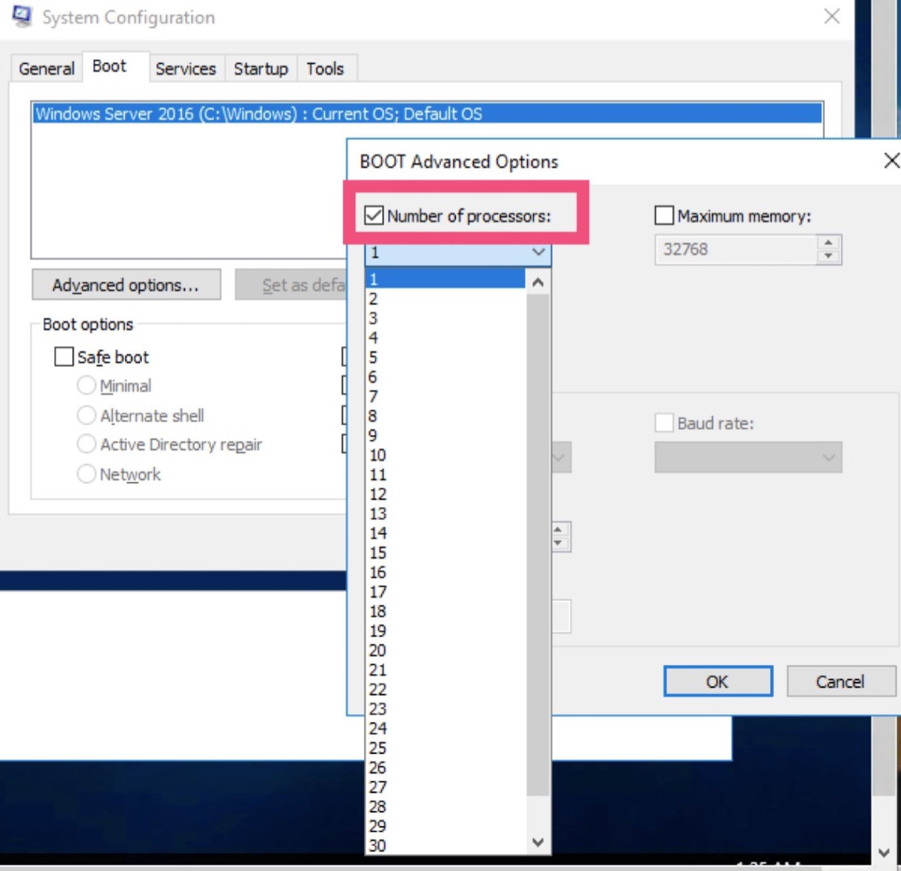

# Reduce core numbers on physical level

In order to make better use of hardware resources, MSSQL servers sometimes are equipped with more than enough cores, which shall be reduced. Here is a simple tutorial to guide through overall procedure.

For example, for a server with 2\*E5-2640v4, it has 10 cores 20 threads each, total 2\*10=20 physical cores, shall only use 10 cores to run SQL, so we are going to reduce 10 physical cores. From OS level, the can be done by following:

* Go to "System Configuration"
* Choose "Boot"
* Choose "Advanced Options"
* 

* Tick "Number of processors", in this case, we have 40 processors originally, so cut by half, choose 20 so that the server will have 20 processors, 10 physical cores. 
* After the change, a reboot will be required to take effect. Please arrange this change during MA time or at your convenience. 

If after reducing core number, servers have abnormal behaviour, it can be rolled back by the same procedure listed above, you only need to untick "Number of processors" and reboot server, that would do the job.  

